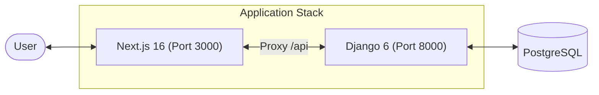
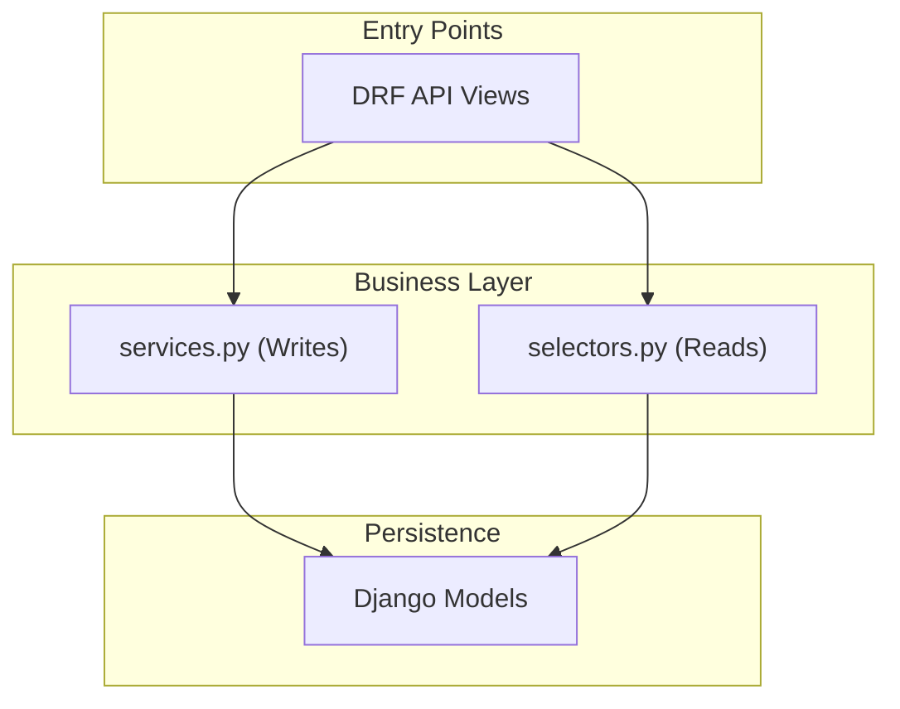
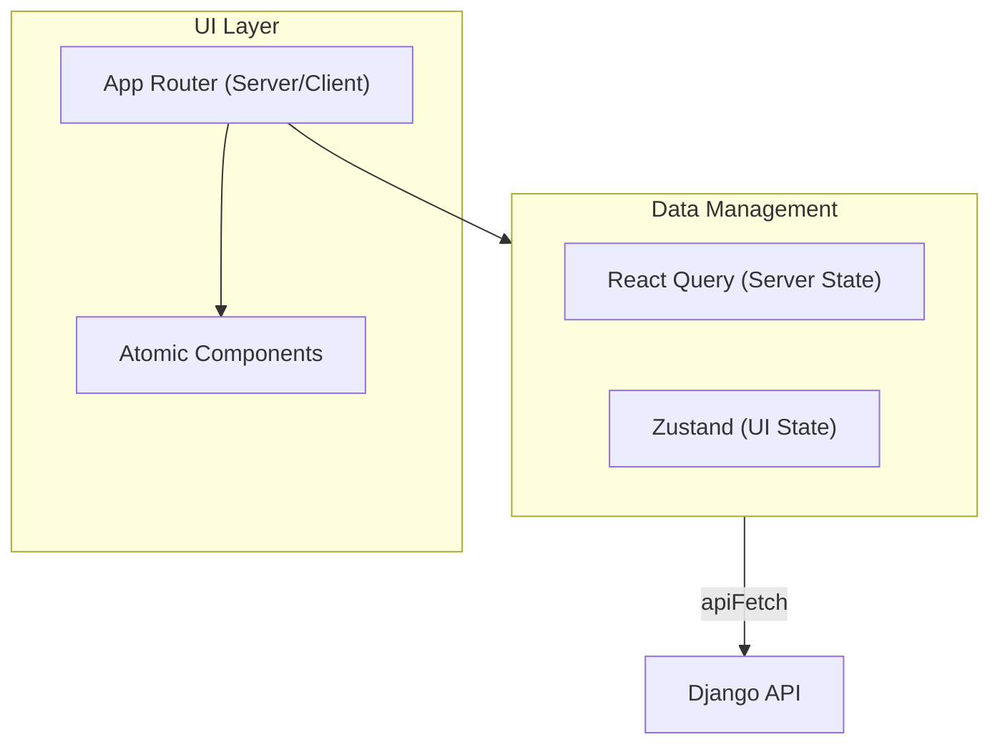

# Project: DjangoTodo

## Stack

| Layer      | Tech                                                              |
| ---------- | ----------------------------------------------------------------- |
| Frontend   | Next.js 16, React 19, TypeScript, CSS Modules, React Query, Zustand |
| Backend    | Django 6, Django REST Framework, SimpleJWT                        |
| Database   | PostgreSQL (Docker) — fallback SQLite                             |
| Auth       | JWT (access + refresh), custom `core.User` model (email-based)    |
| Infra      | Docker Compose (Postgres only), WhiteNoise (static files)         |

## Project Structure

```
djangotodo/
├── backend/            # Django project (manage.py at root)
│   ├── server/         # Django settings, urls, wsgi/asgi
│   ├── core/           # Custom User model, auth views, exception handlers
│   └── todo/           # Todo app — models, views, services, selectors, signals
├── frontend/           # Next.js app
│   └── src/
│       ├── app/        # Pages (App Router)
│       ├── components/ # UI components (CSS Modules per component)
│       ├── hooks/      # Custom hooks (useAuth, etc.)
│       ├── lib/        # API client utilities
│       ├── providers/  # React Query provider
│       ├── store/      # Zustand store (UI-only state)
│       └── templates/  # Template pattern for client-side logic
└── docker-compose.yml  # PostgreSQL service
```

## Commands

### Database

```sh
# Start PostgreSQL
docker compose up -d

# Stop PostgreSQL
docker compose down
```

### Backend (`backend/`)

```sh
# 1. Activate venv
source .venv/bin/activate

# 2. Install dependencies
pip install -r requirements.txt

# 3. Apply migrations
python manage.py migrate

# 4. Run dev server (port 8000)
python manage.py runserver

# Other useful commands
python manage.py makemigrations   # Generate new migrations
python manage.py createsuperuser  # Create admin user
python manage.py test             # Run tests

> [!TIP]
> If `pip` or `python` commands fail with permissions/not found errors, use the binary directly:
> `./backend/.venv/bin/python3 manage.py <command>`
```

### Frontend (`frontend/`)

```sh
# Install dependencies
pnpm install

# Dev server (port 3000)
pnpm dev

# Build
pnpm build

# Lint
pnpm lint
```

## API Proxy

Frontend proxies `/api/*` → `http://localhost:8000/api/*` via Next.js rewrites (`next.config.ts`).

## Auth Flow

1. **Register**: `POST /api/register` — creates user, returns JWT pair
2. **Login**: `POST /api/token` — email + password → access + refresh tokens
3. **Refresh**: `POST /api/token/refresh` — refresh token → new access token
4. **Access token lifetime**: 15 min | **Refresh**: 7 days (rotating)

## Environment Variables

| File              | Key                 | Purpose                          |
| ----------------- | ------------------- | -------------------------------- |
| `.env` (root)     | `POSTGRES_*`        | Docker Compose DB credentials    |
| `backend/.env`    | `DATABASE_URL`      | DB connection string             |
|                   | `SECRET_KEY`        | Django secret key                |
|                   | `DEBUG`             | Debug mode toggle                |
|                   | `ADMIN_PATH`        | Obfuscated admin route           |
|                   | `ALLOWED_HOSTS`     | Comma-separated allowed hosts    |
|                   | `CORS_ALLOWED_ORIGINS` | Comma-separated CORS origins  |
| `frontend/.env`   | `DJANGO_API_URL`    | Backend URL for API proxy        |

## Visual Architecture

### System Context


### Backend Architecture (Services/Selectors)


### Frontend Architecture (State & Components)


## Code Styles

### Frontend (Next.js / React)
- **React 19**: Maximize use of Server Components. Use `use client` only for interactivity.
- **Styling**: Strict adherence to **CSS Modules**. No Tailwind. Name files `[Component].module.css`.
- **State**:
  - **React Query**: For all server-side data fetching and mutations.
  - **Zustand**: Only for global UI-related state (e.g., active filters, modals).
- **Naming**: `PascalCase` for components/files, `camelCase` for variables/functions.

### Backend (Django / DRF)
- **Logic Placement**: Business logic belongs in `services.py`. Data fetching belongs in `selectors.py`. Keep Views thin.
- **DRF**: Use `APIView` with internal `InputSerializer` and `OutputSerializer` for clarity.
- **Typing**: Use Python type hints (`from typing import ...`) for all function signatures.
- **Naming**: `snake_case` for files/functions/variables, `PascalCase` for classes.

## Security Considerations
- **Auth**: JWT tokens are stored in cookies. Refresh tokens must be **HttpOnly**.
- **CORS**: Managed in `settings.py` via `CORS_ALLOWED_ORIGINS`. Never allow `*` in production.
- **Database**: Use Django ORM to prevent SQL injection.
- **Input**: Always validate data via Serializers (DRF) or Type guards (TS).

## General Coding Guidelines
- **Small Components**: If a component exceeds 200 lines, split it.
- **Error Handling**: Use the central `ApplicationError` in the backend and `apiFetch` error handling in the frontend.
- **Consistency**: Follow the existing pattern of `templates/` for major page sections.
- **Imports**: Use absolute paths (`@/components/...`) in the frontend.
