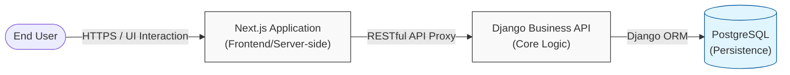
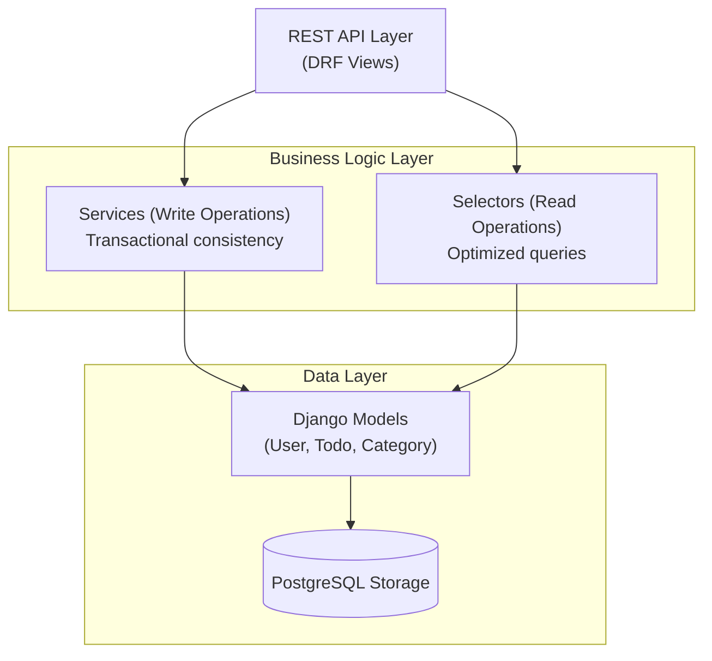
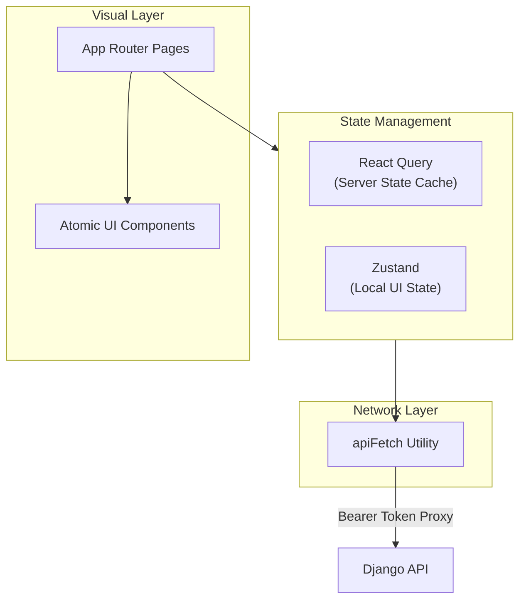
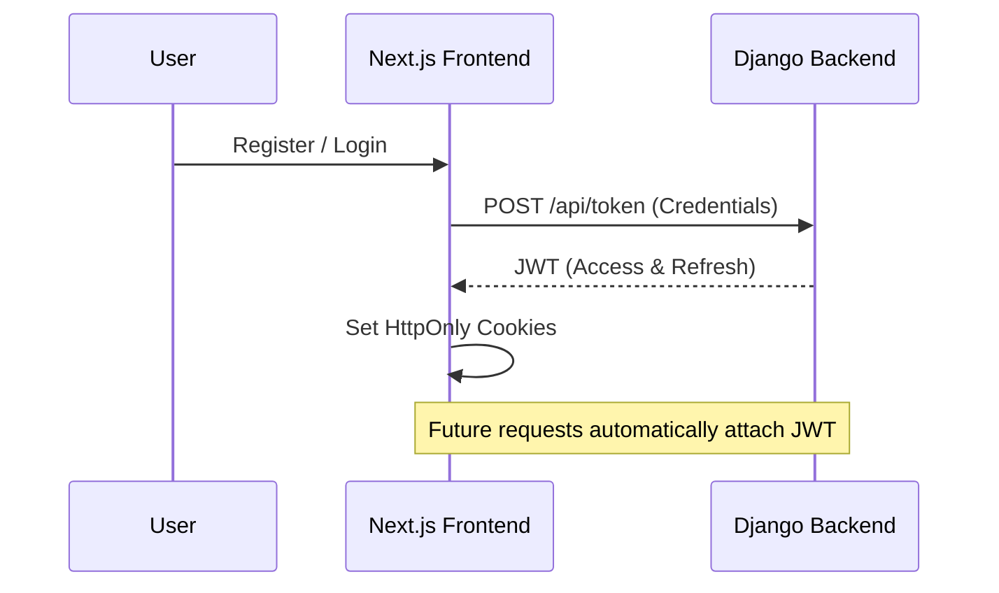

# Architecture Overview

This document outlines the high-level architecture of the DjangoTodo application, focusing on system integration, core design patterns, and security.

## Unified System Architecture

A decoupled full-stack architecture designed for scalability and clear separation of concerns.

---

## Backend Engine & Data Strategy

The backend follows the **Services/Selectors** pattern to decouple business logic from API views.

---

## Frontend & State Architecture

Modern React architecture utilizing Server Components for initial load and Hooks for interactive state.

---

## Security Framework

Authentication is handled via JSON Web Tokens (JWT) with secure cookie persistence.

---

## Infrastructure

The local environment is containerized for consistency across development stages.

| Service    | Tech Stack  | Role                                      | Port |
| ---------- | ----------- | ----------------------------------------- | ---- |
| **Frontend** | Next.js 15  | Rendering, Routing, UI Logic              | 3000 |
| **Backend**  | Django 5    | Identity, Business Rules, REST API        | 8000 |
| **Database** | PostgreSQL  | Relational Persistence                    | 5432 |

### Local Commands
- **Frontend**: `npm run dev` (in `/frontend`)
- **Backend**: `python manage.py runserver` (in `/backend`)
- **Database**: `docker compose up -d`
